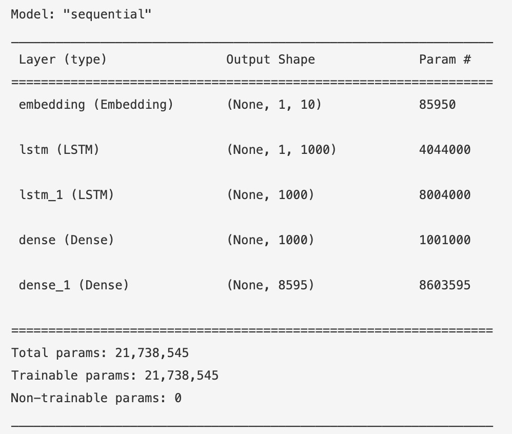
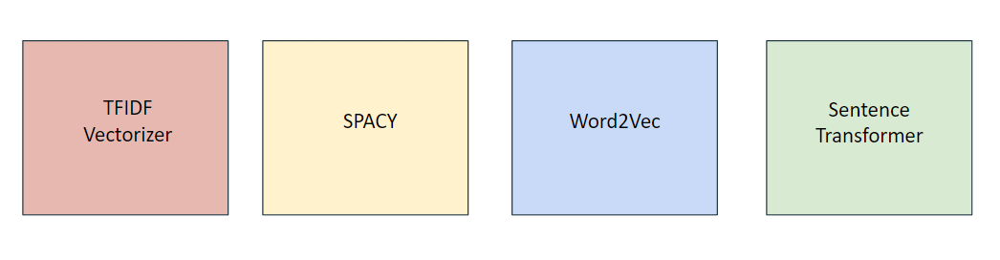

# Auto Completion and Movie Recommendation
### By: Avi Arora, Raghav Sharma, Tahera Ahmed, Sonali Pednekar

## Usage
This model has been deployed and can be explored further at :
https://avisionary-autocomplete-feature-app-nlp-u649hs.streamlit.app/

## Introduction
The term text prediction means a set of computer programs and algorithms, which help users edit text with higher efficiency. It can be seen in computer and mobile device applications such as email editors, texting, and web browsers. 
Auto-completion refers to the completion of a word, or a phrase, as we start typing in a document. The prediction is based upon the selection of the most likely word from a set of frequently used words. 
The text prediction task consists of editing text with the minimum number of keystrokes feasible. This method is suggesting words that the user intended to write, and the system predicts the next word related to the previous work.
A recommendation system predicts and filters user preferences after learning about the user’s past choices. A movie recommendation engine predicts and filters user preferences after learning about the user's past choices.

## Objective 
The project is divided into two parts:
* Auto complete an input sentence given by the user.
* Suggest movie recommendations based on the 5 words displayed by the auto complete feature. 

## Methodology
The proposed system has multiple modules:
* The text data is preprocessed using a pipeline. Using definite steps such as tokenization, stemming and lemmatization, it is then passed on to the model.
* The model accepts lemmatized input and forwards it to the text extraction unit, which then branches out into the autocomplete engine, which is responsible for prediction.
* The application will be deployed on streamlit. After deployment, the predictions will be tested and necessary statistics will be measured.

## Next word prediction using LSTM
* Long Short Term Memory (LSTM) networks are a type of Recurrent Neural Network that can learn order dependence. The output of the previous step is used as input in the current step in RNN. 
* RNN is unable to predict words stored in long-term memory but can make more accurate predictions based on current data. As for LSTM, it may keep information for a long time by default. 

 

## Movie Recommendation
The idea is to push the prediction model one step further:
* To recommend top 3 movies with a complete sentence formed by the Auto-Complete prediction tool
* As the efficiency is currently compromised, user will be provided with top 5 predicted words for them to make a choice.
* These predictions will be based on matching genres, title and description of the movie.

These are the different models that were used for the movie recommendation section. 
* TFIDF Vectorizer: TF-IDF stands for term frequency-inverse document frequency and it is a measure, used in the fields of  
    information retrieval (IR) and machine learning, that can quantify the importance or relevance of string representations (words, phrases, lemmas, etc)  in a document amongst a collection of documents (also known as a corpus).
* Spacy: spaCy is a free, open-source library for NLP in Python. It's written in Cython and is designed to build information 
        extraction or natural language understanding systems. It's built for production use and provides a concise and user-friendly API.
* Word2Vec: word2vec is not a singular algorithm, rather, it is a family of model architectures and optimizations that can be 
            used to learn word embeddings from large datasets. Embeddings learned through word2vec have proven to be successful on a variety of downstream natural language processing tasks.
* Sentence Transformer: SentenceTransformers is a Python framework for state-of-the-art sentence, text and image embeddings. The 
                        initial work is described in our paper Sentence-BERT: Sentence Embeddings using Siamese BERT-Networks. You can use this framework to compute sentence / text embeddings for more than 100 languages.

 

## Deploying application on Streamlit
Streamlit is a free, open-source Python framework which can be used to easily build and share interactive dashboards and machine learning web apps.
Steps for deployment:
* Export the ML model as a pickle (or h5 for neural networks) file
* Create a streamlit interface to interact with our pickle file.
* Get model results from the streamlit interface.
* Deploy the streamlit app.

## Results
* Text prediction and autocomplete can help people to increase their writing speed by predicting the relevant words. 
* The model has proved efficient in prediction and completion of text. The results from recommendation algorithms add to the comfort of user allowing them to navigate better on the app.
* Use of Perplexity

## Future Scope
A new dataset can be created containing the ‘sent gmail’ text message of the group members (which can be retrieved using Google Takeout). The text can be then processed, converted from mbox to txt and then cleaned using a pipeline. Then, this text will be feeded into our LSTM model to make an auto complete feature personal to each of the team members.

